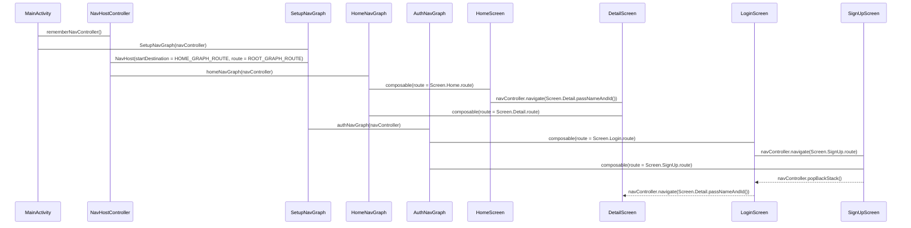

# Compose Navigation Example

This project demonstrates the implementation of navigation in Jetpack Compose using the `androidx.navigation:navigation-compose` library. It showcases a modular navigation graph setup, including authentication and home flows.

## Architecture

The navigation architecture is structured into three main graphs:

-   **Root Graph**: The main entry point, defining the overall navigation structure.
-   **Home Graph**: Contains the flows for the home screen and detail screen.
-   **Auth Graph**: Manages the authentication flow, including login and signup screens.

The `MainActivity` sets up the `NavHostController` and the `SetupNavGraph` composable, which then defines the navigation structure.

## Navigation Flow

The following diagram illustrates the navigation flow between different screens and navigation graphs:

## Key Components

**MainActivity.kt:** Initializes the NavHostController and sets up the navigation graph.

**NavGraph.kt:** Defines the root navigation graph and includes the home and auth navigation graphs.

**HomeNavGraph.kt:** Defines the navigation graph for the home screen and detail screen.

**AuthNavGraph.kt:** Defines the navigation graph for the authentication flow (login and signup).

**Screen.kt:** Defines the routes for different screens.

**HomeScreen.kt:** The home screen composable.

**DetailScreen.kt:** The detail screen composable.

**LoginScreen.kt:** The login screen composable.

**SignUpScreen.kt:** The signup screen composable.

## Explanation
1.  **Project Overview:** The README starts with a brief description of the project and its purpose.
2.  **Architecture:** It describes the high-level architecture, focusing on the different navigation graphs.
3.  **Navigation Flow Diagram:** A sequence diagram illustrates the navigation flow between the main components, including the `MainActivity`, `NavHostController`, navigation graphs (`HomeNavGraph`, `AuthNavGraph`), and screens (`HomeScreen`, `DetailScreen`, `LoginScreen`, `SignUpScreen`).  The diagram shows how navigation calls are made and how the different composables interact.
4.  **Key Components:**  The README lists the key files and their roles in the navigation structure, with links to the files in the repository.
